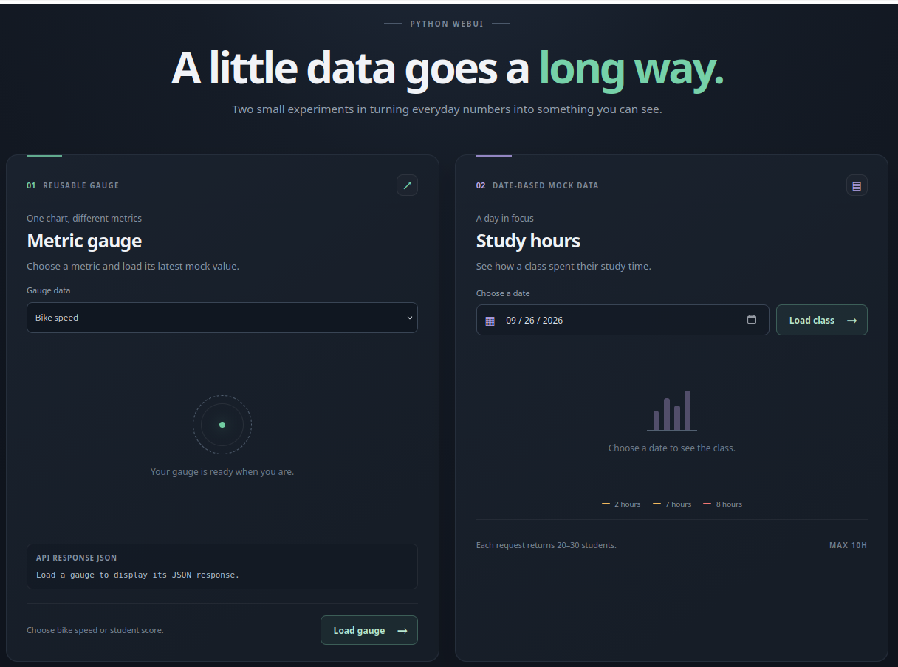
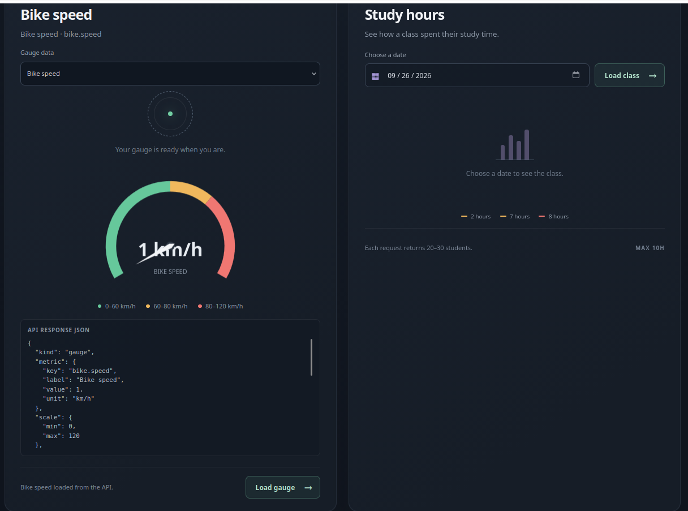
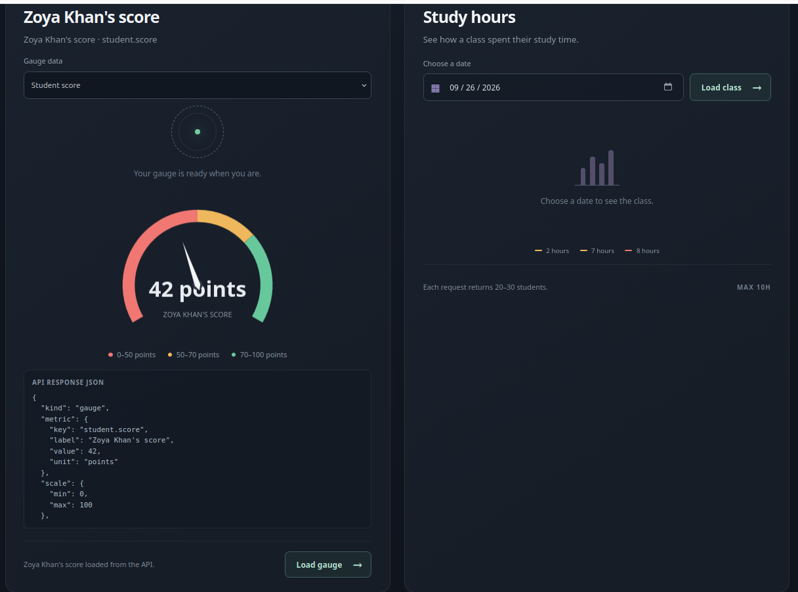
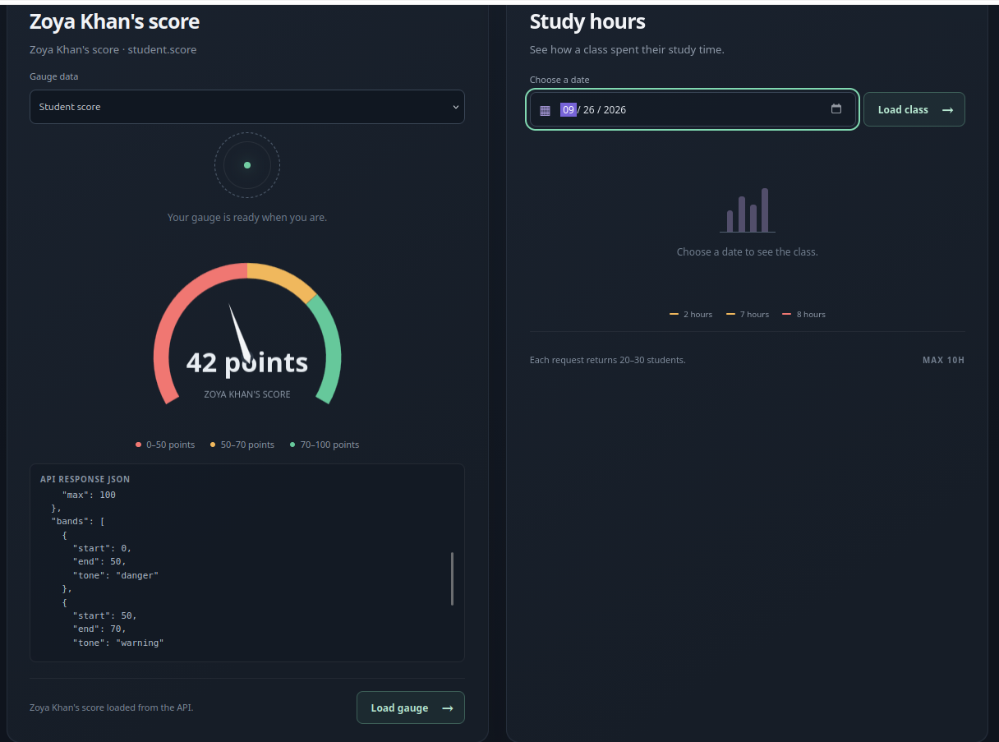
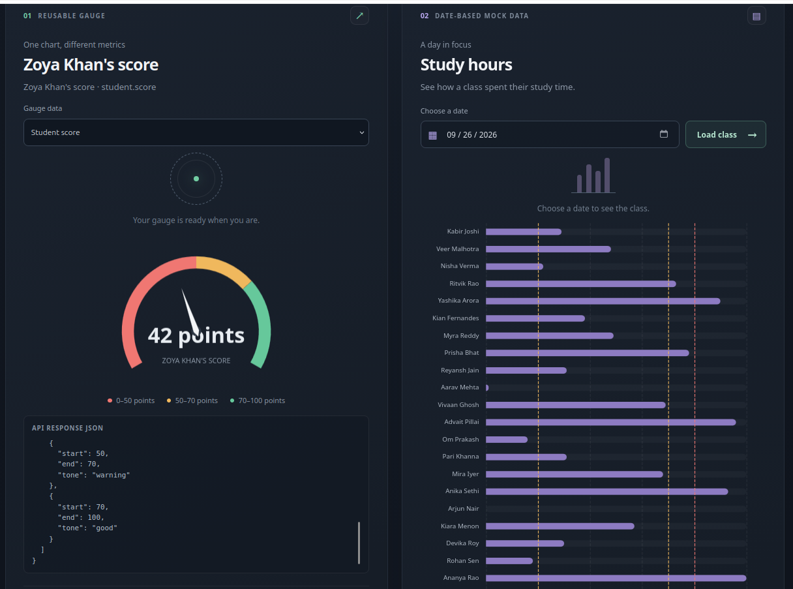

# Vibe Python WebUI

A small learning project with a static HTML/CSS/JavaScript frontend, Apache ECharts, and a FastAPI backend. The reusable gauge and student study-hours chart load independently when their Load controls are used.

## Tech stack

| Area | Technology | Version / notes |
| --- | --- | --- |
| Frontend | HTML, CSS, browser JavaScript | No frontend framework |
| Charts | Apache ECharts | 6.1.0, served locally |
| Date input | Native HTML date input | No additional date-picker library |
| Backend | Python and FastAPI | Python `>=3.10`; FastAPI 0.141.1 |
| ASGI server and worker | Gunicorn native `asgi` worker | Gunicorn 26.2.0 |
| Package manager | pip | Build machine uses its installed pip; the offline bundle includes pip for the target |

## Why runtime files live under `app/`

`app/` groups the FastAPI code with the HTML, CSS, and JavaScript it serves. The static files are included in the wheel and located relative to `app/main.py`, so the installed app does not depend on the source checkout or working directory.

## Use case snapshots

Panel 1 reuses one gauge for bike speed and student score. The selected metric determines the REST endpoint; the response supplies the title, value, unit, scale, and color bands. Panel 1 also displays the JSON response after each load. Panel 2 shows study hours for the selected date.



### Bike speed

Choose **Bike speed** and press **Load gauge**. The browser calls `GET /api/gauges/bike-speed`. The response provides a random value from 0–120 km/h and green, amber, and red bands covering 0–60, 60–80, and 80–120 km/h. The Study hours panel remains unchanged.



Press **Load gauge** again to refresh the selected metric:



### Student score

Choose **Student score** and press **Load gauge**. The browser calls `GET /api/gauges/student-score`. The response provides a randomly selected student name, an integer score from 0–100 points, and red, amber, and green bands covering 0–50, 50–70, and 70–100 points. The same gauge renderer displays it; no second gauge page is needed.

### Study hours

Select a date and press **Load class**. The browser sends the date as JSON to `POST /api/students/study-hours`. The panel shows a horizontal bar for each of 20–30 randomly selected students, with study values from 0–10 hours. Reference lines mark 2 hours (amber), 7 hours (amber), and 8 hours (red). The Gauge panel remains unchanged.

Each panel reports its own loading state or API error. Loading again refreshes only that panel with new mock data.





## Gauge API contract

Both gauge endpoints return the same JSON shape. Metric-specific values, scales, and bands vary; `kind` identifies the visualization. The frontend maps `good`, `warning`, and `danger` tone names to dashboard colors and converts the semantic data into ECharts options.

```json
{
  "kind": "gauge",
  "metric": {
    "key": "bike.speed",
    "label": "Bike speed",
    "value": 70,
    "unit": "km/h"
  },
  "scale": { "min": 0, "max": 120 },
  "bands": [
    { "start": 0, "end": 60, "tone": "good" },
    { "start": 60, "end": 80, "tone": "warning" },
    { "start": 80, "end": 120, "tone": "danger" }
  ]
}
```

`GET /api/gauges/bike-speed` and `GET /api/gauges/student-score` return this contract. FastAPI validates that a gauge value falls within its scale and that the ordered bands cover the full scale. The API does not return ECharts configuration, keeping chart-library details in the browser.

## Run the app

Requirements: Python 3.10 or newer with `venv` and pip available. The build machine's system pip is used only through `python3 -m pip`; it does not modify system Python packages. From the project root:

```bash
python3 -m venv runvibe-python-webui
runvibe-python-webui/bin/python -m pip install -e .
runvibe-python-webui/bin/python -m gunicorn app.main:app --worker-class asgi
```

Open <http://127.0.0.1:8000>. Gunicorn's native `asgi` worker is required for FastAPI. ECharts 6.1.0 is bundled under `app/static/vendor/`, so the page does not need internet access to load its chart library. The native HTML date input provides the date picker.

## Python packaging: wheel and source distribution

A **wheel** (`.whl`) is a built package that installs without building the project during installation. This dashboard's app wheel is universal (`py3-none-any`) because its Python code and static assets are platform-independent. Wheels for dependencies can be platform-specific, so an offline wheelhouse must match the target OS, CPU architecture, and Python version. Use wheels when you want a direct install without a build step.

A **source distribution** (`.tar.gz`, or sdist) contains source files and build metadata. pip builds a wheel from it during installation, which requires a compatible build backend and its dependencies. Native extensions can also require a compiler and system libraries. Use an sdist to distribute or rebuild source, or if no compatible wheel is available. An sdist alone is not a self-contained offline deployment bundle.

For deployment, use the universal app wheel with all runtime dependency wheels built for the target environment. Build a separate bundle for each target platform/Python combination when necessary. Python itself must already be installed on the target; the bundle contains Python packages, not the interpreter.

## Package and install offline with pip

The build machine needs Python 3.10 or newer and pip already installed. It also needs package-index access when the required wheels are not already available locally. The target machine does not need internet access or pip installed separately. Its Python installation must include the `venv` module. Build using the target Python minor version, operating system, and CPU architecture so pip selects compatible dependency wheels. Create a separate bundle for each incompatible target combination. Before rebuilding, remove any previous `pip-env` directory so the archive cannot include stale wheels.

From the project root on the connected build machine:

```bash
rm -rf pip-env pip-env.tar.gz
mkdir -p pip-env/wheelhouse
python3 -m pip wheel . --wheel-dir pip-env/wheelhouse
python3 -m pip download --only-binary=:all: --dest pip-env/wheelhouse pip
tar -czf pip-env.tar.gz pip-env
```

The bundle contains the app wheel, all runtime dependency wheels, and a pip wheel. Transfer `pip-env.tar.gz` to the target. First check whether its matching Python can create a virtual environment:

```bash
tar -xzf pip-env.tar.gz
cd pip-env
python3 -m venv --help
```

If the check succeeds, create an environment without pip:

```bash
python3 -m venv --without-pip runvibe-python-webui
```

Seed pip from its bundled wheel. This uses Python to load pip directly from the wheel, so pip and `ensurepip` do not need to exist first:

```bash
PIP_WHEEL=$(basename wheelhouse/pip-*.whl)
PIP_WHEEL_PATH="$(pwd)/wheelhouse/$PIP_WHEEL"
PYTHONPATH="$PIP_WHEEL_PATH" runvibe-python-webui/bin/python -m pip install --no-index --find-links wheelhouse pip
```

Then install and run the app offline:

```bash
runvibe-python-webui/bin/python -m pip install --no-index --find-links wheelhouse 'vibe-python-webui==0.1.0'
runvibe-python-webui/bin/python -m gunicorn app.main:app --worker-class asgi --bind 0.0.0.0:8000
```

The target needs the matching Python version and the ability to create a virtual environment. It does not need internet access or system-level pip. The app, pip, and all runtime dependencies are included in the wheelhouse. If `venv` itself is missing, the `python3 -m venv` command will fail; a system administrator must supply the matching venv component, or the bundle must be redesigned to include a target-specific Python runtime. This deployment recipe transfers a wheel, not an sdist.
